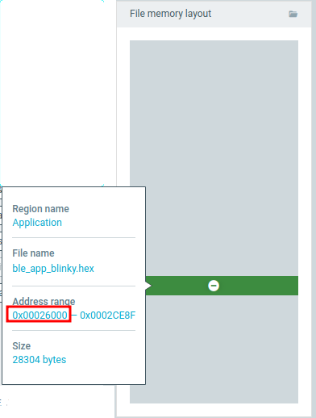
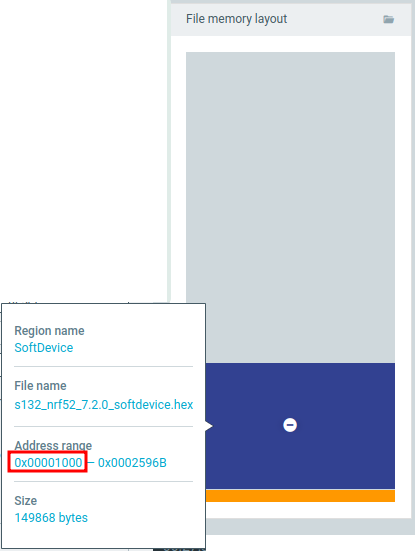
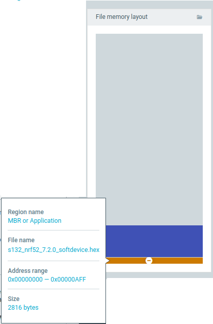

- [Structures](#structures)

# Structures

This folders contains the following files which compiled from sdk17.1.0 with the private key in the folder `keys/`

- [sources/52/softdevices.hex](sources/52/softdevices.hex): `s132_nrf52_7.2.0_softdevice.hex` (s132-0x0101) of `sdk 17.1.0`.
- [sources/52/secure_bootloader.hex](sources/52/secure_bootloader.hex) compiled from the example `secure_boothloader/pca10040_s132_ble` of `sdk 17.1.0`
- [sources/52/app.hex](sources/52/app.hex): compiled from the example `ble_app_blinky/pca10040` of `sdk 17.1.0`.
- [source/52/sniffer.hex](sources/52/sniffer.hex): `sniffer_nrf52dk_nrf52832_4.1.1`
- [sources/51/softdevices.hex](sources/51/softdevices.hex): `s130_nrf51_2.0.1_softdevice.hex` (s130-0x87) of `sdk 12.3.0`.
- [sources/51/secure_bootloader.hex](sources/51/secure_bootloader.hex) compiled from the example `boothloader_secure/pca10028/armgcc` of `sdk 12.3.0`
- [sources/51/app.hex](sources/51/app.hex): compiled from the example `ble_app_alert_notification/pca10028` of `sdk 12.3.0`.
- [source/51/sniffer.hex](sources/51/sniffer.hex): `sniffer_nrf51dk_nrf51422_4.1.1`
Here is the memory layout of the above files

1. app_blinky.hex:

    

2. s132_nrf52_7.2.0_softdevice.hex
    

    

3. Bootloader: However, it seems that the bootloader is oversize

    

    

When connect nrf52 to the program nrf_connect:

