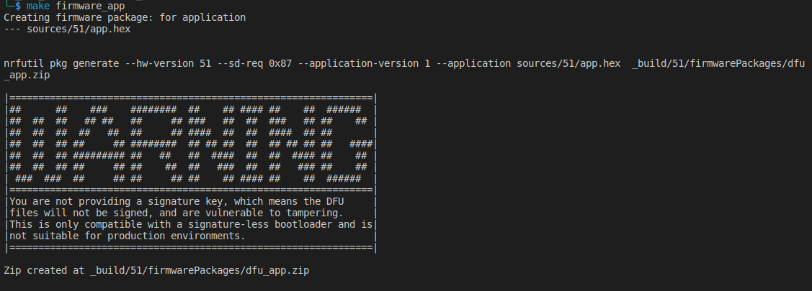

- [Structures](#structures)
- [Some pictures](#some-pictures)

# Structures

This folders contains the following files which compiled from sdk17.1.0 with the private key in the folder `keys/`

- [sources/51/softdevices.hex](sources/51/softdevices.hex): `s130_nrf51_2.0.0_softdevice.hex` (s130-0x87) of `sdk 11.0.0`.
- [sources/51/bootloader.hex](sources/51/bootloader.hex) compiled from the example `boothloader/pca10028/armgcc/` of `sdk 11.0.0`
- [sources/51/app.hex](sources/51/app.hex): compiled from the example `ble_app_alert_notification/pca10028` of `sdk 11.0.0`.
- [source/51/sniffer.hex](sources/51/sniffer.hex): `sniffer_nrf51dk_nrf51422_4.1.1`

# Some pictures

