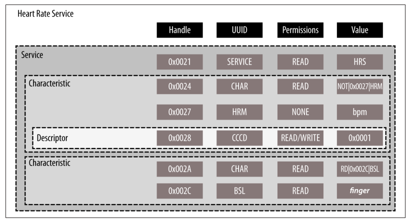

- [Bluetooth Low Energy (BLE)](#bluetooth-low-energy-ble)
  - [The Specification](#the-specification)
  - [Configurations](#configurations)
    - [Based on Specification Support](#based-on-specification-support)
    - [Based on Chip Count](#based-on-chip-count)
  - [Key Limitations](#key-limitations)
    - [Data throughput](#data-throughput)
    - [Operating range](#operating-range)
  - [Network topology](#network-topology)
    - [Broadcasting](#broadcasting)
    - [Connections](#connections)
  - [Protocols versus Profiles](#protocols-versus-profiles)
    - [Generic Profiles](#generic-profiles)
    - [Use-Case-Specific Profiles](#use-case-specific-profiles)
      - [SIG-defined GATT-based profiles](#sig-defined-gatt-based-profiles)
      - [Vendor-Specific Profiles](#vendor-specific-profiles)
- [Some information about the BLE](#some-information-about-the-ble)
- [Link layer](#link-layer)
  - [Advertising events](#advertising-events)
  - [Connection Events](#connection-events)
    - [First connection event](#first-connection-event)
  - [Packet Format](#packet-format)
- [Preamble](#preamble)
  - [Access Address](#access-address)
- [The book Getting started with BLE](#the-book-getting-started-with-ble)
- [Attribute Protocol (ATT)](#attribute-protocol-att)
  - [ATT operations](#att-operations)
  - [Generic Attribute Profile (GATT)](#generic-attribute-profile-gatt)
  - [GAP Service](#gap-service)
- [GATT (Services and Characteristics)](#gatt-services-and-characteristics)
  - [Roles](#roles)
  - [UUIDs](#uuids)
  - [Attributes](#attributes)
  - [Handle](#handle)
  - [Type](#type)
  - [Permissions](#permissions)
  - [Value](#value)
- [GATT data hierarchy](#gatt-data-hierarchy)
  - [Services](#services)
  - [Characteristics](#characteristics)
    - [Characteristic declaration attribute](#characteristic-declaration-attribute)
    - [Characteristic value attribute](#characteristic-value-attribute)
    - [Characteristic Descriptors](#characteristic-descriptors)
- [Example Service](#example-service)

---

This notes taken from the [book](References/Getting%20Started%20with%20Bluetooth%20Low%20Energy.pdf).

# Bluetooth Low Energy (BLE)

- Other name: Bluetooth Smart
- Started as part of the Bluetooth 4.0 Core Specification.
- Originally designed by Nokia as Wibree.
- Focus: design a radio standard with the lowest possible power consumption, specifically opotimized for low cost, low bandwidth, low power and low complexity.

The fundamental difference with classic Bluetooth, which focused on a strict set of use cases. BLE, on the other hand, was conceived to allow anyone with an idea and a bunch of data points coming from an accessory to realize it without having to know a huge amount about the underlying technology.

## The Specification

In June 2010, the Bluetooth SIG (Bluetooth Special Interest Group) introduces BLE with version 4.0 of the Bluetooth Core Specification. The first major update, Bluetooth 4.1, was realeased in December 2013 and is the current reference for anyone looking to develop BLE products. This book (note) use the Bluetooth 4.1 sepcification as reference.

## Configurations

- Classic Bluetooth (BR/EDR)
- Bluetooth Low Energy (BLE)
  
  Those above comminication standards are not directly compatible. The on-air protocol, the upper protocol layers, and the applications are different and incompatible between two techonologies.

  Bluetooth devices qualifed on any specification version prior to 4.0 cannot communicate in any way with a BLE device.

### Based on Specification Support

- Single-mode (BLE) device: device that implements BLE, which can comminicate with single-mode and dual-mode devices, but not with devices supporting BR/EDR only.
- Dual-mode (BR/EDR/LE, Bluetooth Smart Ready) Device: A device that implements both BR/EDR and BLE, which can communicate with any Bluetooth device.

### Based on Chip Count

Every Bluetooth device has three main building blocks:

- Application: The user application interfaceing with the Bluetooth protocol stack to cover a particular use case.
- Host: The uppder layers of the Bluetooth protocol stack.
- Controller: The lower layers of the Bluetooth protocol stack, including the radio.

Additionally, the Host Controller Interface (HCI) is a standard communication protocol between the host and the controller, produced by different companies.

These layers are implemented in a single integrated circuit (IC) or chip, or be split in several ICs connected through a communication layer (UART, USB, SPI, or other). There are three most common configurations

- SoC: A single IC runs the application, the host, and the controller. Simple sensors tend to use Soc configurations to keep the cost and printed circuit board (PCB) complexity low.
- Dual IC over HCI: Addvantage: since the HCI is defined by the Bluetooth specification, any host can be combined with andy controller, regardless of the manufacturer. Mostly used by smartphones, tablets since they usually already have a powerful CPU available to run the protocol stack.
- Dual IC with connectivity device: Since the specification does not include such a protocol, the application must be adapted to the specific protocol of the chosen vendor. Can be used in a watch with a specialized microcontroller to which BLE connectivity is added without overhauling the whole design.

## Key Limitations

### Data throughput

- The modulation rate of the BLE radio is set by the specification at a constant 1Mbps. In reality, it is only about 10KB/s.
  - Some other information that may be useful for the project: The nRF51822 SoC can transmit up to six data packets per connection interval (the interval between two consecutive connection events). Each outgoing data packet can contain up to 20 bytes of user data (set by the specification unless higher packet sizes are negotiated). Assume the shortest connection interval of 7.5ms. This provides a maximum of 133 connection events per second and 120 bytes per connection event. Real-world rate: 15960 bytes/s or 0.125Mbit/s or 125 Kbit/s

### Operating range

- very short-range communication. Typical range is probably closer to 2 to 5 meters with a conscious effort to reduce the range and save battery life without the transmission distance.
- Transmit power (typically measured in dBm) usually between -30 and 0 dBm. The higher the transmit power, the more demands are placed on the battery, reducing the usable lifetime of the battery cell(s).

## Network topology

- broadcasting or connections

### Broadcasting

 Send data out one-way to anyone or anything that is capable of picking up the transmitted data. There are two separate roles:

- Broacaster: sends nonconnectable advertising packets periodically to anyone willing to receive them.
- Observer: repeatedly scans the preset frequencies to receive any nonconnectable advertising packets currently being broadcasted.

It is the only way for a device to transmit data to more than one peer at a time, using the advertising features of BLE.

It is fast and easy to use and a good choice if you want to push only a small amount of data on a fixed schedule or to multiple devices.

A major limitation is there are no secuirty or privacy provisions at all.

### Connections

To transmit data in both directions or have more data than the two advertising payloads can accomodate.

It is a permanent, periodical data exchange of packets between two devices.

There are two separate roles:

- Central (master): repeatedly scans the preset frequencies for connectable advertising packets and, when suitable, initates a connection. Once the connection is established, the central manages the timing and initiates the periodical data exchanges.
- Peripheral (slave): A device that send a connectable advertising packets periodically and accepts incoming connections. Once in an active connection, the peripheral follows the contral's timing and exchanges data regularly with it.

Before version 4.1 of the specification, the peripheral can only have a single central connection and have limited role. From 4.1, any  restrictions on role combinations have been removed.

Biggest advantage of connections comparing to broadcasting is the ability to orgainize the data with much finer-grained control over each field or property through the use of additional protocol layers and, more specifically, the Genereic Attribute Profile (GATT). Data is organized around units called services and characteristics.

## Protocols versus Profiles

- Protocols: building blocks used by all devices conformant to the Bluetooth specification, protocols are the layers that implement the different packet formats, routing, multiplexing, encoding, and decoding that allow data to be sent effectively between peers
- Profiles: "vertical slices" of functionality covering either baisc modes of operation required by all devices (Generic Access Profile, Generic Attribute Profile) or specific use cases (Proximity Profile, Glucose Profile), profiles essentially define how protocols should be used to achive a particular goal, whether generic or specific.

### Generic Profiles

- Generic Access Profile (GAP): the topmost control layer of BLE, is mandatory for all BLE devices and all must comply with it. It deals with lower-level radio protocols to define roles, procedures and modes that allow devices to broadcast data, dicover devices, establish connections, manage connections and negotiate security levels,...
- Generic Attribute Profile (GATT): the topmost data layer of BLE, dealing with data exchange.

### Use-Case-Specific Profiles

- Limited to GATT-based profiles. No non-GATT profiles exist now (at time of the writing book) but may start to appear in the future.

#### SIG-defined GATT-based profiles

- Find Me Profile: Allows devices to physically locate other devices
- Proximity Profile: Detects the presence or absence of nearby devices
- HID over GATT Profile: Transfer HID data over BLE (keyboards, mice, remote controls)
- Glucose Profile: Securely transfers glucose levels over BLE
- Health Thermometer Profile: Transfers body temperature readings over BLE
- Cycling Speed and Cadence Profile: Allows sensors on a bicycle to transfer speed and cadence data to a smartphone or tablet

#### Vendor-Specific Profiles

Allows vendors to define their own profiles for use cases not covered by the SIG-defined profiles.

# Some information about the BLE

- The maximum size of LE packet is 27 bytes. (allowed by 4.2 specification is 251 bytes)
- L2CAP layer has been simplified a lot to support a very limited number of CIDs (channel identifiers) and signaling commands.
- 

(Inside Bluetooth Low energy, 142)

(Inside Bluetooth Low energy, 142)

The Master sets the hop increment value at the time of creation of a connection. It sets it to a random value between 5 and 16.

# Link layer

## Advertising events

The Advertiser is advertising on all the three advertising channels consecutively in rotation.

Delta time: time between two consecutive events in BLE. It can be used to estimate the distance between devices.

## Connection Events

- The start of a connection event is called an Anchor Point. At the Anchor Point, the Master trnsmits a data channel PDU to the Slave.
- After that, the Master and Slave send packets alternately during the connection event. The Slave always responds to a packet from the Master while the Master may or may not respond to a packet from the Slave.
- All packets in a connection event are transmitted on the same frequency.
- Channel hopping occurs at the start of every connection event.

### First connection event

The master provides two parameters in the CONNECT_REQ PDU to indicate the transmit window: Size and offset.

## Packet Format

Has only one packet format that is used for both advertising and data physical channels.

# Preamble

is an alternate sequence of 1s and 0s of length 1 bytes (8bits) and a vlue of 0xAA

## Access Address

- 4 bytes (32 bits)

# The book Getting started with BLE

# Attribute Protocol (ATT)

The Attribute Protocol (ATT) is a simple client/server stateless protocol based on attributes presented by a device.

Each server contains data organized in the form of attributes, each of which is assigned:

- a 16-bit attribute handle: an identifier used to access an attribute value
- a universally unique identifier (UUID): specifies the type and nature of the data contained in the value
- a set of permissions
- a value

More about UUIDs:

- UUIDs: 128-bit (16 bytes) number, globally unique.
- Other formats: 16-bit, 32-bit. Used only with UUIDs that are defined in the BLE specification (listed by the Bluetooth SIG as standard Bluetooth UUIDs)
- Shortening is not available for vendor-specific UUIDs. In this case, we need to use the full 128-bit UUID value at all times.

## ATT operations

- Error Handling:
  - Error Response
- Server Configuration:
  - Echange MTU Request/Response
- Find Information:
  - Find Information Request/Response: obtain a list of all attributes in a particular handle range
  - Find by Type Value: obtain the handle range between an attribute identified by its UUID and its value and the next group delimiter
- Read Operations:
  - Read by Type Request/Response: Obtain the value of attribues using a UUID
  - Read Request/Response: obtain the value of attributes using a handle
  - Read Blob Request/Response
  - Read Multiple Request/Response
  - Read by Group Type Request/Response: similar to Read by Type but the UUID must be a grouping type
- Write Operations
  - Write Request/Response
  - Write Command: can be send at any time, not follow the request/response
  - Signed Write Command
- Queued Writes:
  - Preapre Write Request/Response
  - Execute Write Request/Response
- Server Initiated:
  - Handle Value Indication/Confirmation
  - Handle Value Notification: sent at any time. Asynchronous server update of an attribute's value and identified by its handle

## Generic Attribute Profile (GATT)

- client/server architecture but the data is encapsulated in servies, which consist of one or more characteristics. Each characteristic can be thought of as the union of a piece of user data along with metadata.

## GAP Service

It is a mandatory GATT service that every device must include among its attributes. The service is freely accessible (read-only) to all connected devices with no security requirements. It has three characteristics:

- Device Name characteristic: user-readable UTF-8 string.
- Apperance characteristic: 16-bit value associates the device with a certain generic category (phone, computer, watch, sensor, ...).
- Peripheral Preferred Connection Parameters (PPCP) characteristic: once the central has established a connection with the peripheral, it can read the value of this characteristic and perform a connection parameter update procedure.

# GATT (Services and Characteristics)

- client/server architecture but the data is encapsulated in servies, which consist of one or more characteristics. Each characteristic can be thought of as the union of a piece of user data along with metadata.
  
## Roles

- Client/Server

## UUIDs

- 128-bit
- other format: 16-bit, 32-bit

## Attributes

Always located on the server and accessed by the client.

Attributes are the smallest data entity defined by GATT (and ATT). They are addressable pieces of information that can contain relevant user data or metadata about the structure and grouping of the differenct attributes contained within the server.

## Handle

The attribute handle is a unique 16-bit identifier for each attribute on a particilar GATT server. It is the part of each attribute that makes it addressable, and it is guaranteed not to change.

The amount of handle available to every GATT server is 0xFFFE.

Gaps between handles are allowed. Hence a client must use the discovery feature to obtain the handles of the attributes it is interested in.

The term handle range refers to all attributes with handles contained between two given boundaries.

## Type

The attribute type is nothing other than a UUID. It can be 16, 32 or 128 bit UUID (2, 4, 16 bytes).

## Permissions

- Access Permissions
- Encryption
- Authorization

## Value

Maximum lenth is 512 bytes.

# GATT data hierarchy

## Services

## Characteristics

- They always include at least two attributes: the characteristic declaration and the characteristic value.
- Additionally, the characteristic value can be followed by descriptors.
- The declaration, value, and any descriptors together form the characteristic definition.

### Characteristic declaration attribute

- UUID (0x2803) is a standardized, unique UUID used exclusively to denote the beginning of characteristics. It has read-only permissions.
- Characteristic Properties

- Characteristic Value Handle: 2 bytes
- Characteristic UUID

### Characteristic value attribute

The type for this attribute is always the same UUID found in the characteristic's declaration value field.

### Characteristic Descriptors

- GATT-defined descriptors
- Profile or vendor-defined descriptors

Some of most commonly used descriptors defined by GATT:

- Extended Properties Descriptor
- Characteristic User Description Descriptor
- Client Characteristic Configuration Descriptor: the most important and commonly used. It acts as a switch, enabling or disabling server-initiated updated only for the characteristic in which it finds itself enclosed.
It is a 2-bit bitfield corresponding to notification and the other to indications. A client can set and clear those bits at any time, and the server will check them every time the characteristic that encloses them has changed value and might be susceptible to an update over the air.
Everytime a client wants to enable notifications or indications for a particular characteristic that supports them, it simply uses a Write Request ATT packet to set the corresponding bit to 1. The server will then reply with a Write Response and start sending the appropriate packets whenever it wants to alert the client of a change in value.
It has two special properties that separate them from other attributes:

  - Their values are unique per connection.
  - Their values are preserved across connections with bonded devices

# Example Service

