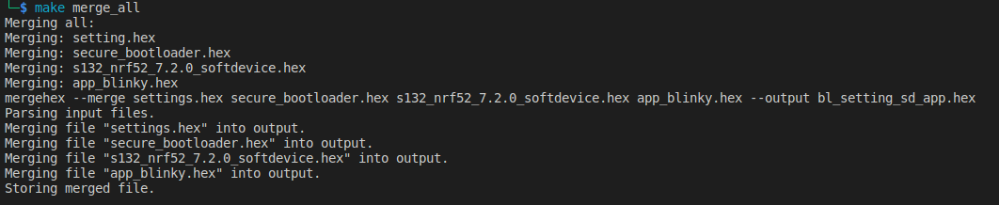
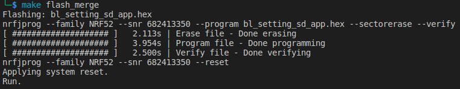
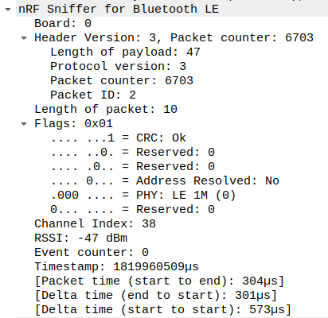
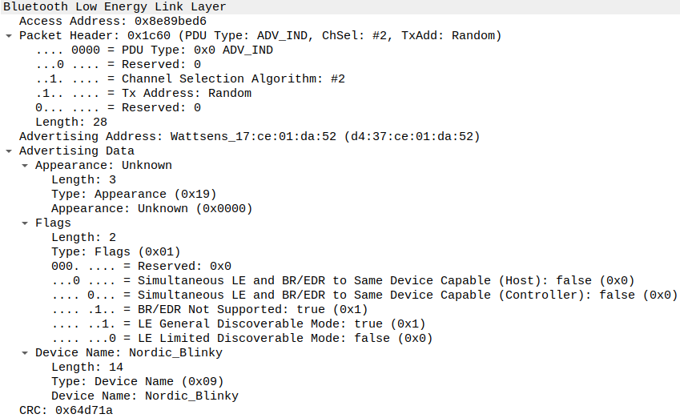

- [What to do next](#what-to-do-next)

Inside the folder [hex_files](../hex_files_and_capturedPackages/), do

```zsh
make merge_all
make flash_merge
```

The board have the bootloader + bootloader setting pages+softdevices + application.





then do the DFU OTA.

I do the process of DFU for some cases:

- bl
- bl+sd
- bl+sd+app
- sd
- sd+app
- app
- bl_setting
- bl_setting+sd
- bl_setting+app

The process of bl_setting, bl_setting_sd, bl, bl_sd, bl_sd_app (not sure) DFU failed.

The process DFU for sd+app, the process doing twice.

When do the DFU without the setting pages in the original state of the board, the result may different.

Some pictures

Advertises of app blinky





# What to do next

<https://github.com/NordicSemiconductor/Android-DFU-Library/blob/main/lib/dfu/src/main/java/no/nordicsemi/android/dfu/ButtonlessDfuImpl.java>

1. understand the applicative protocol used to perform the DFU, analyse the different packets in pcap file - use java source code (client side) and C code (server side)
2. analyse the relationship between the application hex file and the traffic - understand INTEL hex format structure and correlate it with packet contents

    identify the version of softdevice in use, try older version of the DFU process and identify main differences betweem them

    softdevice vX - SDK vY - secure dfu - field a == 0x1224 and packet X

-----------------------------------
