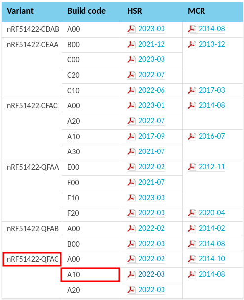
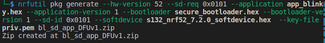

- [Boards](#boards)
  - [PCA numbers and chips](#pca-numbers-and-chips)
  - [Information about two used boards](#information-about-two-used-boards)
- [Perform DFU OTA with BLE](#perform-dfu-ota-with-ble)
  - [Download nRF SDK](#download-nrf-sdk)
  - [Install gcc-arm-none-eabi from apt ubuntu](#install-gcc-arm-none-eabi-from-apt-ubuntu)
  - [Install gcc-arm-none-eabi lastest version](#install-gcc-arm-none-eabi-lastest-version)
  - [Clone micro-ecc git repository](#clone-micro-ecc-git-repository)
  - [Install nrfutil](#install-nrfutil)
  - [Generate private key using nrfutil](#generate-private-key-using-nrfutil)
  - [Flash softdevices, bootloader or application](#flash-softdevices-bootloader-or-application)
    - [Erase board](#erase-board)
    - [Flash softdevices](#flash-softdevices)
    - [Flash bootloader](#flash-bootloader)
    - [Flash application](#flash-application)
  - [Setting pages](#setting-pages)
  - [Merge file and flash to the board](#merge-file-and-flash-to-the-board)
  - [Generate firmware packages](#generate-firmware-packages)
  - [Perform DFU](#perform-dfu)
  - [Other Installation may need](#other-installation-may-need)
- [Error in compiling sdk 11.0.0 bootloader](#error-in-compiling-sdk-1100-bootloader)

# Boards

## PCA numbers and chips

<https://infocenter.nordicsemi.com/topic/ug_gsg_ses/UG/gsg/chips_and_sds.html>




## Information about two used boards

- [nRF 52832](https://www.nordicsemi.com/Products/nRF52832)
- [nRF 51422](https://www.nordicsemi.com/Products/nRF51422)

# Perform DFU OTA with BLE

Some links maybe helpful

[part3](https://novelbits.io/ota-device-firmware-update-part-3/?_gl=1*1th9rt3*_ga*OTk3MzI5ODk1LjE2ODAxODY5OTk.*_ga_FTRKLL78BY*MTY4MDE4Njk5OC4xLjEuMTY4MDE4NzMwMS40My4wLjA.&_ga=2.86154520.1439965188.1680186999-997329895.1680186999)

[part4](https://novelbits.io/nrf52-ota-dfu-ble-part-4/)

## Download nRF SDK

Link [nRF SDK](https://www.nordicsemi.com/Products/Development-software/nRF5-SDK/Download#infotabs) in zip files. Extract

## Install gcc-arm-none-eabi from apt ubuntu

```zsh
sudo apt install gcc-arm-none-eabi
```

Find the location of the binary file

```zsh
arm-none-eabi-gcc --version
```


Find the folder of arm-none-eabi-gcc binary file


go the the folder after extracting nRF SDK, modify the file `./components/toolchain/gcc/Makefile.posix`

```text
GNU_INSTALL_ROOT = /usr/bin/
GNU_VERSION = 10.3.1
GNU_PREFIX = arm-none-eabi
```

## Install gcc-arm-none-eabi lastest version

- Download the lastest version source file then extract
- Add the path of the binary file to $PATH
- Then modify the Makefile.posix

```text
GNU_INSTALL_ROOT = /home/studynewthing/bleOTA/gcc-arm-none-eabi/arm-gnu-toolchain-12.2.mpacbti-rel1-x86_64-arm-none-eabi/bin/
GNU_VERSION = 12.2.1
GNU_PREFIX = arm-none-eabi
```

## Clone micro-ecc git repository

- clone git rep of micro-ecc inside the folder micro-ecc.
- run make in the folder `micro-ecc/nrf52hf_armgcc/armgcc

## Install nrfutil

- download the excutable file nrfutil
- run
  
  ```zsh
  nrfutil install nrf5sdk-tools
  ```

## Generate private key using nrfutil

- Now create a folder to create and store the key; go to this folder.
- Generate a private key priv.pem

```zsh
nrfutil keys generate priv.pem
```

- Display the public key that corresponds to the generated private key (in code format to be used with DFU)

```zsh
nrfutil keys display --key pk --format code priv.pem
```

- Write the public key that corresponds to the generated private key to the file public_key.c (in code format)

```zsh
nrfutil keys display --key pk --format code priv.pem --out_file dfu_public_key.c
```

- Then copy the `dfu_public_key.c` to the folder `/examples/dfu/`

## Flash softdevices, bootloader or application

### Erase board

```zsh
nrfjprog -f nrf52 --eraseall
```

### Flash softdevices

```zsh
nrfjprog -f nrf52 --program s132_nrf52_7.2.0_softdevice.hex --sectorerase
nrfjprog -f nrf52 --reset
```

### Flash bootloader

```zsh
nrfjprog -f nrf52 --program ble_app_blinky.hex --sectorerase
nrfjprog -f nrf52 --reset
```

### Flash application

```zsh
# flash application
nrfjprog -f nrf52 --program _build/nrf52832_xxaa.hex --sectorerase
nrfjprog -f nrf52 --reset
```

## Setting pages

A DFU bootloader requires a bootloader setting page

```zsh
nrfutil settings generate --family NRF52 --application ble_app_blinky.hex --application-version 1 --bootloader-version 1 --bl-settings-version 2 bl_settings.hex
```


## Merge file and flash to the board

```zsh
mergehex --merge bl_settings.hex secure_bootloader.hex s132_nrf52_7.2.0_softdevice.hex ble_app_blinky.hex --output bl_sd_settings_app.hex

nrfjprog -f nrf52 --eraseall

nrfjprog -f nrf52 --program bl_sd_settings_app.hex --sectorerase
```

sn 682413350

## Generate firmware packages


```zsh
nrfutil pkg generate --hw-version 52 --application-version 1 --application ble_app_blinky.hex --sd-req 0x0101 --key-file ../keys/priv.pem app_dfu_package.zip
```

Generate only Bootloader

```zsh
nrfutil pkg generate --hw-version 52 --sd-req 0x0101 --bootloader-version 1 --bootloader secure_bootloader.hex --key-file priv.pem BootloaderDFUv1.zip
```


Generate only Softdevice

```zsh
nrfutil pkg generate --hw-version 52 --sd-req 0x0101 --softdevice s132_nrf52_7.2.0_softdevice.hex --key-file priv.pem softdeviceDFUv1.zip
```


Generate only app

```zsh
nrfutil pkg generate --hw-version 52 --sd-req 0x0101 --application-version 1 --application app_blinky.hex --key-file priv.pem app_blinkyDFUv1.zip
```


Generate bl+sd

```zsh
nrfutil pkg generate --hw-version 52 --sd-req 0x0101 --bootloader-version 1 --bootloader secure_bootloader.hex --softdevice s132_nrf52_7.2.0_softdevice.hex  --key-file priv.pem bl_sd_DFUv1.zip
```


Generate sd+app

```zsh
nrfutil pkg generate --hw-version 52 --sd-req 0x0101 --application app_blinky.hex --application-version 1 --sd-id 0x0101 --softdevice s132_nrf52_7.2.0_softdevice.hex  --key-file priv.pem sd_app_DFUv1.zip
```


Generate BL+SD+APP

```zsh
nrfutil pkg generate --hw-version 52 --sd-req 0x0101 --application app_blinky.hex --application-version 1 --bootloader secure_bootloader.hex --bootloader-version 1 --sd-id 0x0101 --softdevice s132_nrf52_7.2.0_softdevice.hex  --key-file priv.pem bl_sd_app_DFUv1.zip
```



Some remarks: for application and bootloader, it requires  the version
for softdevices, it requires the id of the new one.

## Perform DFU

- Turn off the board. Turn on the power while hold button 4 to go into DFU mode.
- Then we can see DfuTarg in the application nrfConnect in the phone. Connect to the device and upload the zip file that we created before.

## Other Installation may need

1. Install [nRF Connect for Desktop](https://www.nordicsemi.com/Products/Development-tools/nrf-connect-for-desktop/download#infotabs) and install Toolchain Manager in nRF Connect

    

2. Install [nRF Command line tools](https://www.nordicsemi.com/Products/Development-tools/nrf-command-line-tools/download#infotabs)

# Error in compiling sdk 11.0.0 bootloader

How to fix:

<https://devzone.nordicsemi.com/f/nordic-q-a/23882/bootloader_dual_bank-sdk11-build-error>
