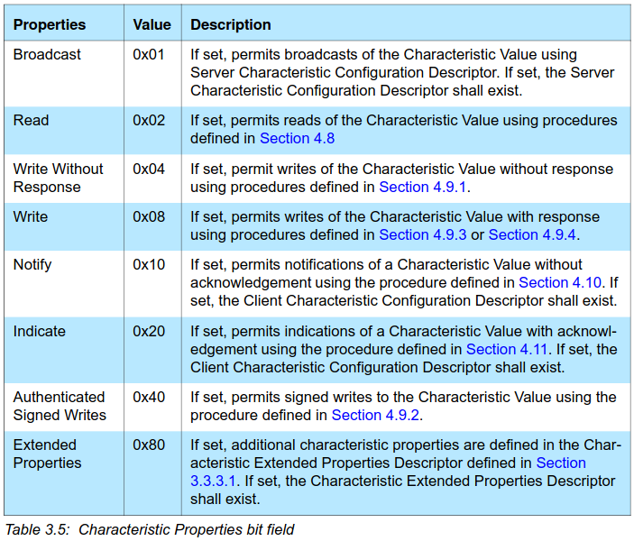

## Create firmware package for legacy bootloader

### Preparing

Need to install old verion of nrfutil:

- clone git repository of pc-nrfutil
<https://github.com/NordicSemiconductor/pc-nrfutil.git>
- git checkout 0_5_1
conda create --name py27

