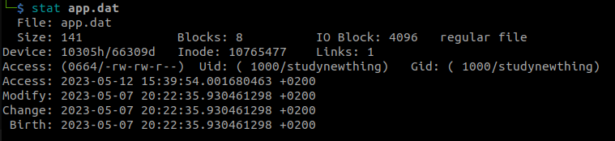
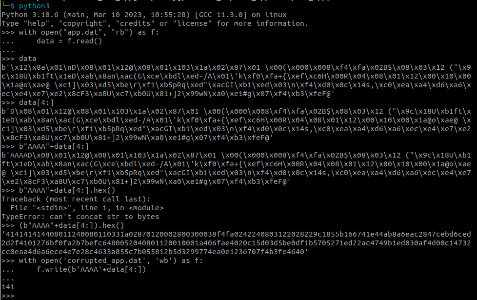

```
hexdump app.bin | more
hexdump app.dat | more
strings app.dat
strings app.bin
wc -c app.dat
stat app.dat
stat -c $s app.dat
```
python3:
hex(141)
b'\x81'
b'\x38'
b'\x8c'
b'\x8c'


hexdump app.dat | cut -c8-
hexdump app.dat |cut -c8- | sed 's/ //g'


python3
with open("app.dat", "rb") as f:
    data = f.read()
data
data[4:]
b"AAAA"+data[4:]
(b"AAAA"+data[4:]).hex()

with open('corrupted_app.dat','wb') as f:
    f.write(b'AAAA'+data[4:])


