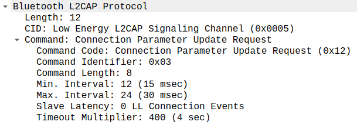
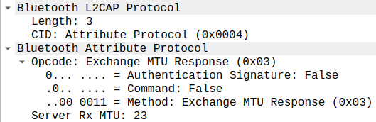
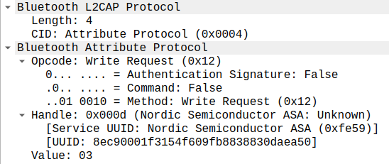

[TOC]

# All packets captured from DFU for application on nrf51

## Advertising
- **ADV_IND: (from Slave)**
    - Access Address: 4 bytes
    - Header:2 bytes: PDU type+Channel Selection Algorithm+Tx Address 
    - Advertising addresses of slave: 6 bytes
    - Advertising data:
      - Flag: 3 bytes
      - UUIDS: 4 bytes
        - Length: 1 byte: 3
        - Type: 1 byte: Service Class UUIDs 0x02
        - UUID: 2 bytes: Nordic Semiconductor ASA 0xfe59
      - Device name: 9bytes
        - length: 1 bytes: 8
        - Device name: 8 bytes: DfuTarg
    - CRC: 3 bytes

## Initial Connection
- **CONNECT_IND: (from Master)**
    - Access Address: 4 bytes
    - Package Header: 2 bytes
    - Master address (Initiator): 6 bytes
    - Slave address (Advertising): 6 bytes
    - Access Address: 4 bytes  (from this, this Access Address is fixed)
    - CRC Init: 3 bytes
    - Window Size: 1 byte
    - Window OffSet: 2 bytes
    - Interval: 2 bytes
    - Latency: 2 bytes
    - Timeout: 2 bytes
    - Channel map: 5 bytes
    - Hop: 1 byte
    - CRC: 3 bytes

- **Control Opcode: LL_FEATURE_REQ (from Master)**
    - Access Address: 4 bytes
    - Data header: 2 bytes. Contains LLID (Link Layer Identifiers which is 2 bits): LLID = 11: Control PDU (0x3). Last byte is length.
    - Control opcode: 1 byte: 0x08
    - Feature Set: 8 bytes: for example: LE encryption, LE 2M PHY,...
    - CRC: 3 bytes
  
  

- **Control opcode: LL_FEATURE_RSP (from Slave)**
    - Access Address: 4 bytes
    - Data header: 2 bytes. Contains LLID (Link Layer Identifiers which is 2 bits): LLID = 11: Control PDU (0x3). Last byte is length.
    - Control opcode: 1 byte: 0x08
    - Feature Set: 8 bytes: Here only accept LE encryption
    - CRC: 3 bytes

- **Control Opcode: LL_VERSION_IND (from Master)**
    - Access Address+Data header
    - Control opcode: 1 byte: 0x0c
    - Version number: 1 byte: 5.0 (0x09)  (this is ble specification version)
    - Company ID: 2 bytes: 0x01ec: Spreadtrum Communications Shanghai Ltd
    - Subversion Number: 2 bytes: 0x0400
    - CRC: 3bytes

- **Control Opcode: LL_VERSION_IND (from Slave)**
    - Access Address+Data header
    - Control opcode: 1 byte: 0x0c
    - Version number: 1 byte: 4.2 (0x08) (this is ble specification version)
    - Company ID: 2 bytes: 0x0059: Nordic Semiconductor ASA
    - Subversion Number: 2 bytes: 0x0087
    - CRC: 3bytes

- **Connection Parameter Update Request: (from Slave)**
    - Access Address: 4 bytes
    - Data header: 2 bytes. Contains LLID (Link Layer Identifiers which is 2 bits). LLID = 10: start an L2CAP message with no fragment. Last byte is length.
    - L2CAP protocol:
      - Length: 2 bytes
      - CID: Channel Identifier: 2 bytes
      - Command: 12 bytes:
        - command code: 1 byte: 0x12 (write)
        - command identifier: 1byte: 0x03
        - command length: 2 bytes: 8
        - Min.Interval: 2 bytes
        - Max.Interval: 2 bytes
        - Slave latency: 2 bytes
        - Timeout Multiplier: 2 bytes
    - CRC: 3 bytes

- **Connection Parameter Update response (Accepted) (from Master)**
    - Access Address: 4 bytes
    - Data header: 2 bytes. Contains LLID (Link Layer Identifiers which is 2 bits). LLID = 10: end an L2CAP message with no fragment. Last byte is length.
    - L2CAP protocol:
      - Length: 2 bytes
      - CID: Channel Identifier: 2 bytes
      - Command: 6 bytes:
        - command code: 1 byte: 0x13 (respond)
        - command identifier: 1byte: 0x03
        - command length: 2 bytes: 2
        - Move result: 2 bytes Accepted (0x0000)
    - CRC: 3 bytes

## Send Read by Group type requests

- **Sent Read by Group type request: GATT primary Service Declaration, Handles: 0x001..0xffff (from Master)**
    - Access Address+Data Header (LLID = 10)
    - L2CAP protocol:
      - Length: 2 bytes : 7
      - CID: 2 bytes: Attribute Protocol 0x0004
      - ATT Protocol: 7 bytes
        - opcode: 1 byte: 0x10: read by group type request
        - starting handle: 2 bytes: 0x0001
        - ending handle: 2 bytes: 0xffff
        - UUID: 2 bytes: GATT Primary Service Declaration 0x2800
    - CRC: 3 bytes
  

- **Rcvd Read by Group Type Response, Attribute List Length: 3, Generic Access Profile, Generic Attribute Profile, Nordic Semiconductor ASA (from Slave)**
    - Access Address+Data Header (LLID = 10)
    - L2CAP protocol:
      - Length: 2 bytes: 20
      - CID: 2 bytes: Attribute Protocol 0x0004
      - ATT Protocol: 20
        - Opcode: 1 byte: 0x11
        - length: 1 byte: 6
        - ATT Data: 6 bytes:
          - Handle: 2 bytes: Generic Access Profile 0x0001
          - Group End Handle: 2 bytes: 0x0007
          - UUID: 2 bytes: Generic Access Profile 0x1800
        - ATT Data: 6 bytes
          - Handle: 2 bytes: Generic Access Profile: 0x0008
          - Group End Handle: 0x0008
          - UUID: Generic Attribute Profile 0x1801
        - ATT Data: 6 bytes
          - Handle: 2 bytes: Nordic Semicondotr ASA: 0x0009
          - Group End Handle: 0xffff
          - UUID: Nordic Semiconductor ASA: 0xfe59

Comparing with the screenshot on Andoid, we can find the DfuService

## Sends Read by Type requests
### First pair (not found)
- Now Master send Read by Type Request (not group type as above) for GATT include Declaration 0x2802

**send**

- Slave responses with error not found
**response**

### Second pair, reply with Device Name, Apperance, Peripheral Preferred connection parameters

Master sends Read by Type request for GATT characteristic Declaration 0x2803
**send**

Slave responses with Device Name, Apperance, Peripheral Preferred connection parameters
**response**

**More details:**

### Next pairs (not found)
Now Master send by type request, GATT characteristic Declaration: Handles 0x0007..0x0007. Slave responses with ATT not found
**send**

**response**

Sent by type request GATT Include Declaration 0x0009..0xffff; not found
**send**

**response**

### Pairs found
Sent by type request GATT characteristic Declaration 0x0009..0xffff: found
**send**

**response**

Sent by type request GATT characteristic Declaration 0x000b..0xffff: found
**send**

**response**

Sent by type request GATT characteristic Declaration 0x000d..0xffff: not found
**send**

**response**

## Find information requests
**send**

**response**

The second time: not found
**send**

**response**

## Exchange MTU requests
**send**

**response**

The second time:
**send**

**response**

## Send Write requests: Client Characteristic configuration
This part has: write requests, write response
**send**

**response**

## Send Write request - write response - notification
**send**

**response**

**Notification**

Now continue
**send**

**response**

**Notification**

Now continue
**send**

**response**

**Notification**

## Send Write Command (8 command)

Value:
128a010a4408011240080110331a028701200028

00300038f4fa0242240803122028229c1855b166

741e44ab8a6eac2847cebd6ced2d2f4101276bf0

fa2b7befc6480052040801120010001a406fae40

20c15d03d5be0df1b5705271ed22ac4749b1ed03

0af4d00c14732cc0eaa4d6a6ece4e7e28c4633a8

55c7b055812b5d3299774ea0e1236707f4b3fe46

40

## Send Write requests- write response -notification (5 triples)
**send**

**response**

**Notification**

## Send Write command (10 commands) +1 notification from slave
Repeat many times "Write command 10 times+ notification"

## Continue mostly the same 
Send Write request-write response-notification (3 triples)
Then Write command 10 times+notification then...

