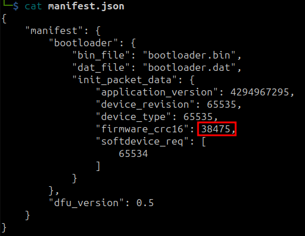

- [Open bootloader](#open-bootloader)
  - [Installation](#installation)
    - [nrfutil old version](#nrfutil-old-version)
  - [Create firmware packages](#create-firmware-packages)
  - [Analyse the dat files](#analyse-the-dat-files)
  - [More detail about the dat files](#more-detail-about-the-dat-files)
  - [Capture the packages during DFU OTA](#capture-the-packages-during-dfu-ota)

# Open bootloader

## Installation

### nrfutil old version

First clone the repository and checkout the branch that have the old version of nrfutil that support creating firmware compatible with sdk 11.0.0.

```zsh
git clone https://github.com/NordicSemiconductor/pc-nrfutil.git
git checkout 0_5_1
```

Read file `README.md` for the installation instruction. One of the requirement is to install python2, which may be difficult now.

```zsh
conda create -y --name python2.7 python=2.7
conda activate python2.7
```

after that, follow the instruction in the README.md file above but with a little bit modified (add option -m)

```zsh
python -m pip install -U setptools
python -m pip install -r requirement.txt
```

After installing the requirement, we run

```zsh
python setup.py install
```

## Create firmware packages

Remember to activate the conda environment above:

```zsh
conda activate python2.7
```

Locate the nrfutil inside the condata environment for example `.../anaconda3/envs/python2.7/bin/nrfutil`

```zsh
whereis nrfutil
```

then run the nrfutil with the above path


```zsh
/home/studynewthing/applications/anaconda3/envs/python2.7/bin/nrfutil dfu genpkg --application app.hex ../firmwarePackages-openbootloader/dfu-open_app.zip

/home/studynewthing/applications/anaconda3/envs/python2.7/bin/nrfutil dfu genpkg --bootloader bootloader.hex ../firmwarePackages-openbootloader/dfu-open_bl.zip

/home/studynewthing/applications/anaconda3/envs/python2.7/bin/nrfutil dfu genpkg --softdevice softdevices.hex ../firmwarePackages-openbootloader/dfu-open_sd.zip
```

## Analyse the dat files

In the above section, we only specify the application or bootloader or softdevices.


We have 0x216a = 8554. Hence the last 2 bytes of app.dat is crc.

Similar, we have





## More detail about the dat files

We add more detail to the firmware packages. The created package names dfu-open_app2.zip.


Supprise that we do not have crc this time.

First two bytes are device type, then device_revision, then application version. The last two bytes are softdevice requirement.

## Capture the packages during DFU OTA