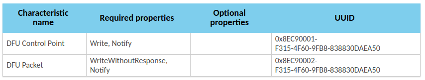
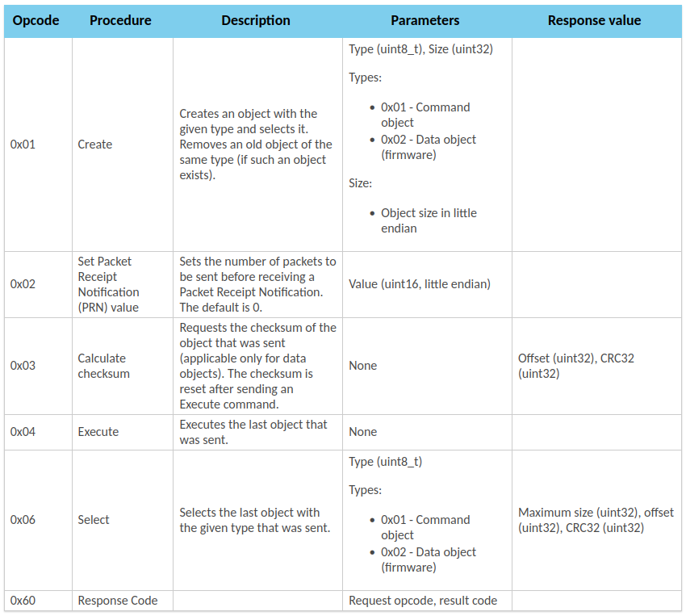
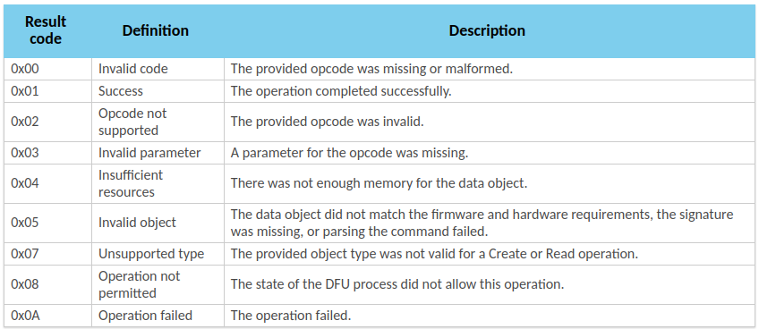
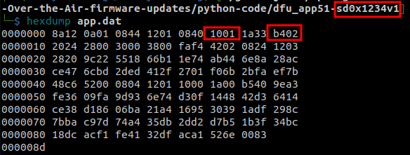
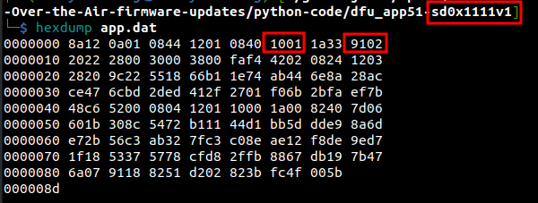
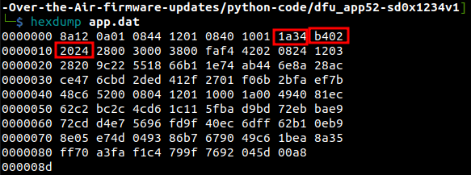
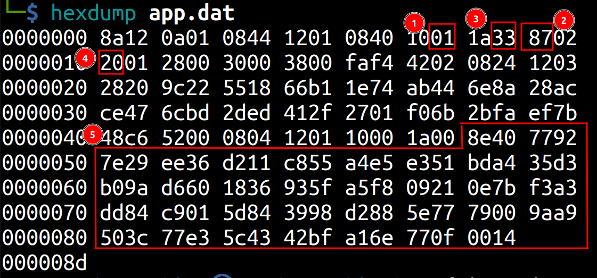

- [DFU OTA app with Secure bootloader (sdk 12.3.0) on nrf51 via Android phone](#dfu-ota-app-with-secure-bootloader-sdk-1230-on-nrf51-via-android-phone)
  - [Values sent-received](#values-sent-received)
  - [Explaination](#explaination)
    - [Information from sdk documentation](#information-from-sdk-documentation)
    - [Applying](#applying)
  - [Reverse app.dat](#reverse-appdat)
    - [Some examples](#some-examples)
    - [Results](#results)
  - [How to compute CRC32](#how-to-compute-crc32)

# DFU OTA app with Secure bootloader (sdk 12.3.0) on nrf51 via Android phone

## Values sent-received

| Handle | Sent                                     | Received                             |
| ------ | :--------------------------------------- | :----------------------------------- |
| 0x000e | 0x0001                                   |                                      |
| 0x000d | 0601                                     | 600601 0001 0000 0000 0000 0000 0000 |
|        | 02 0000                                  | 600201                               |
|        | 0101 8d00                                | 600101                               |
| 0x000b | 128a010a4408011240080110331a028701200028 |                                      |
|        | 00300038f4fa0242240803122028229c1855b166 |                                      |
|        | 741e44ab8a6eac2847cebd6ced2d2f4101276bf0 |                                      |
|        | fa2b7befc6480052040801120010001a408e9277 |                                      |
|        | 297e36ee11d255c8e5a451e3a4bdd3359ab060d6 |                                      |
|        | 36185f93f8a521097b0ea3f384dd01c9845d9839 |                                      |
|        | 88d2775e0079a99a3c50e377435cbf426ea10f77 |                                      |
|        | 14                                       |                                      |
|        |                                          |                                      |
| 0x000d | 03                                       | 600301 8d00 0000 c5 6c 4d 24         |
|        | 04                                       | 600401                               |
|        | 02 0a00                                  | 600201                               |
|        | 0602                                     | 600601 0010 0000 0000 0000 0000 0000 |
|        | 0102 0010 0000                           | 600101                               |
|        |                                          |                                      |
| 0x000b | 0080002021590200615902006359020000000000 |                                      |
|        | 0000000000000000000000000000000000000000 |                                      |
|        | 0000000065590200000000000000000067590200 |                                      |
|        | 69590200f1df01006b59020021e901006b590200 |                                      |
|        | 6b5902000000000041e401006b5902006b590200 |                                      |
|        | 6b5902006b5902006b5902006b5902006b590200 |                                      |
|        | 6b5902006b5902006b59020015b701006b590200 |                                      |
|        | 6b590200f1b701006b590200816402006b590200 |                                      |
|        | 6b5902006b590200000000000000000000000000 |                                      |
|        | 0000000000000000000000000448054b10b58342 |                                      |
|        |                                          | 600301 c8000000 82899e87             |
|        |                                          | ...                                  |
|        |                                          | ...                                  |
|        |                                          | 600301 90010000 188eb8a5             |
|        |                                          | 600301 58020000 38386f1b             |
|        |                                          | 600301 20030000 b448eecf             |
|        |                                          | 600301 e8030000 b1e2742f             |
|        |                                          | 600301 b0040000 db42e210             |
|        |                                          | 600301 78050000 a04399c6             |
|        |                                          | 600301 40060000 c3d73b9c             |
|        |                                          | 600301 08070000 7fe50ea9             |
|        |                                          | 600301 d0070000 122a20a0             |
|        |                                          | 600301 98080000 898d0f60             |
|        |                                          | 600301 60090000 7b69fdec             |
|        |                                          | 600301 280a0000 9feb7d51             |
|        |                                          | 600301 f00a0000 5639f129             |
|        |                                          | 600301 b80b0000 22068d1e             |
|        |                                          | 600301 800c0000 9ee5c511             |
|        |                                          | 600301 480d0000 4aad509c             |
|        |                                          | 600301 100e0000 2bf3bfea             |
|        |                                          | 600301 d80e0000 ea43e47b             |
|        |                                          | 600301 a00f0000 fe1e226c             |
|        |                                          |                                      |
|        | 03                                       | 600301 00100000 69aa84d7             |
|        | 04                                       | 600401                               |
|        | 0102 0010 0000                           | 600101                               |

Continue to send totally 4096 bytes.
|        |              |                        |
| ------ | ------------ | ---------------------- |
| 0x000d | 03           | 6003010010000069aa84d7 |
|        | 04           | 600401                 |
|        | 010200100000 | 600101                 |
|        |              |                        |
Then send 4096 bytes and so on.

Some of the last write commmands are:

|     |                                          |                          |
| --- | ---------------------------------------- | ------------------------ |
|     |                                          | 600301 48bd0000 09642611 |
|     | 000000001818181818181818181800000024f400 |                          |
|     | 35b1010009b10100000000000000000001ca0100 |                          |
|     | 03ff0000                                 |                          |
|     |                                          |                          |
|     | 03                                       | 600301 74bd0000 0e6e5c4b |
|     | 04                                       | 600401                   |

## Explaination

### Information from sdk documentation

[https://infocenter.nordicsemi.com/topic/com.nordic.infocenter.sdk5.v12.3.0/lib_dfu_transport_ble.html](https://infocenter.nordicsemi.com/topic/com.nordic.infocenter.sdk5.v12.3.0/lib_dfu_transport_ble.html)

Control point procedure operation codes and the respective parameters and response values:

The result codes that are sent as part of the response:

### Applying

- 0001: trigger the DFU
- 0601:
  - 06: Select
  - 01: Create command object
- 60 0601 0001 0000 0000 0000 0000 0000:
  - 60: Response code
  - 06: request opcode
  - 01: result code
  - 0001 0000: Maximum size
  - 0000 0000: Offset
  - 0000 0000: CRC32, initial value
- 02 0000: Set PRN value to be 0
- 600201:
  - 60: Response code
  - 02: request opcode
  - 01: success
- 0101 8d00 0000:
  - 0101: Create command object
  - 8d00 0000: Size in little endian. 0x8d= 141
- 600101:
  - 60: response code
  - 01: request code
  - 01: success

Then the client sends data to the GATT server. Each package maximum size is 20 bytes which is (MTU-3). There are 7 packages of 20 bytes and one package of 1 byte. Totaly, there are 141 bytes.

- 03: request calculate checksum
- 600301 8d000000 c56c4d24:
  - 60: response code
  - 03: request code
  - 01: success
  - 8d000000: offset
  - c5 6c 4d 24: CRC32
- 04: Execute the last object that was sent
- 02 0a00:
  - 02: Set PRN value
  - 0a00: little endian, which is 10. It means that client will receive a notification every 10 "write" commands.
- 600201:
  - 60: response code
  - 02: request code
  - 01: success
- 0602:
  - 06: select last object
  - 02: data object (firmware)
- 600601 0010 0000 0000 0000 0000 0000:
  - 60: response code
  - 06: request code
  - 01: success
  - 0010 0000: maximumsize
  - 0000 0000: offset
  - 0000 0000: CRC32
- 0102 0010 0000:
  - 01: Create
  - 02: Data object
  - 0010 0000: Size in little endian: 4096
- 600101:
  - 60: response code
  - 01: request code
  - 01: success

## Reverse app.dat

### Some examples

Softdevices 0x1234 - application version 1:

Softdevices 0x1111 - application version 1:

Softdevices 0x87 - application version 9:

Hardware version 52

Softdevices 0x1234 - application version 1:

### Results

- 1: application version
- 2: softdevice version
- 3+4: hardware version
- 5: signature of the hash

Not sure if these values are two bytes or one byte long.

## How to compute CRC32

nRF5 SDK 12.3.0 `\components\libraries\crc32\crc32.c`
