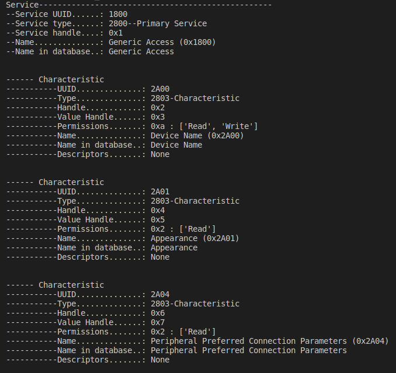

# Reverse sdk 12.3.0 secure bootloader nrf51

## Reverse

[https://infocenter.nordicsemi.com/topic/com.nordic.infocenter.sdk5.v12.3.0/lib_dfu_transport_ble.html](https://infocenter.nordicsemi.com/topic/com.nordic.infocenter.sdk5.v12.3.0/lib_dfu_transport_ble.html)

Some pictures from above link:

## Discovery

## Manual doing DFU using Whad

