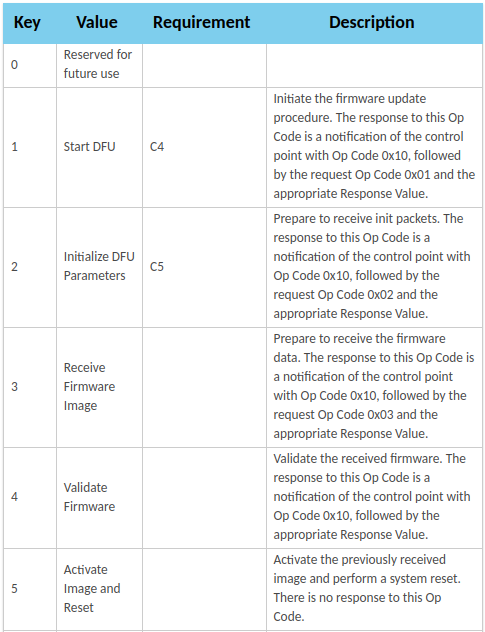
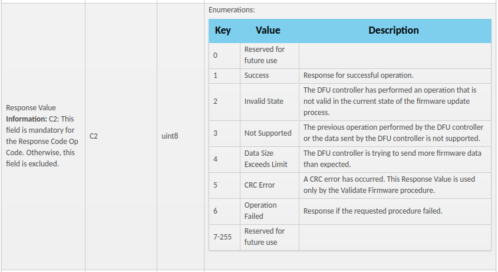

# Reverse sdk 9.0.0

## About

### Flashing files, creating firmware

This folder contains some files compiled from sdk9.0.0: app, bootloader. It also has the softdevice hex file and the sniffer hex file (to flash to nrf52).

To flash a file to nrf51, run
```zsh
make flash_bl_sd_app
```
To create firmware for doing the DFU, run
```zsh
make firmware_app
```
**Remark**: To create the firmware app, we need to use version 0.5.1 of nrfutil (in nrfutil git repository - branch 0_5_1). To install this version, we need python 2.7 (here create a conda environment name "py27"). After installing, run the following command to find the path of nrfutil
```zsh
whereis nrfutil
```
With nrfutil 0.5.1, the path should be similar to `<Install path of anaconda3>/anaconda3/envs/py27/bin/nrfutil`. Then modify the variable `legacy_nrfutil` in the Makefile to be this path.

### Sniffing the packages when doing DFU

There are two ways: using wireshark and Android phone. This folder has two files corresponding to the sniffing by wireshark and Android phone:

- [packagesWireshark_dfu_app_hrs_s110_nrf51_sdk9.0.0.pcapng](packagesWireshark_dfu_app_hrs_s110_nrf51_sdk9.0.0.pcapng)
- [packagesBtnoopAndroid_dfu_app_hrs_s110_nrf51_sdk9.0.0.log](packagesBtnoopAndroid_dfu_app_hrs_s110_nrf51_sdk9.0.0.log)


## DFU protocol

Here is the link for opcode+response code, which will be use to understand the DFU protocol:

[https://infocenter.nordicsemi.com/topic/com.nordic.infocenter.sdk51.v9.0.0/bledfu_transport_bleservice.html](https://infocenter.nordicsemi.com/topic/com.nordic.infocenter.sdk51.v9.0.0/bledfu_transport_bleservice.html)

Some images:







## Using Whad

### Discover services and characteristics

Here is the list of services and characteristics of the app from sdk9.0.0


Here is the result from reading the readable characteristics:


### Doing DFU manually

Here is the result from doing DFU via python using Whad. Need to put sleep between some write commands, otherwise, it will response with code 03

