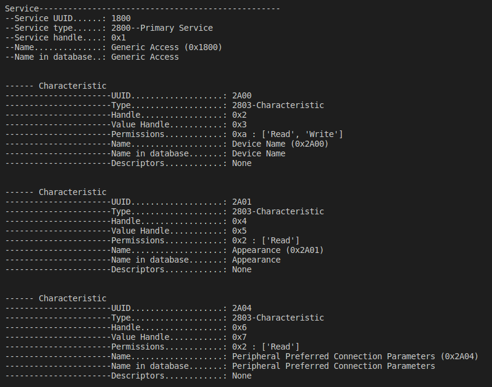
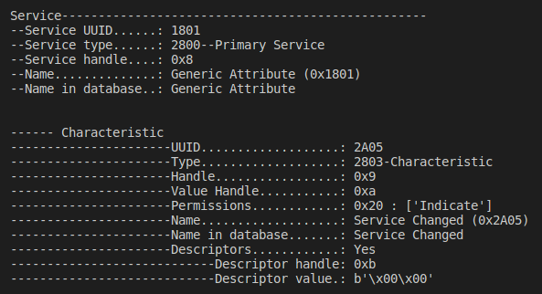
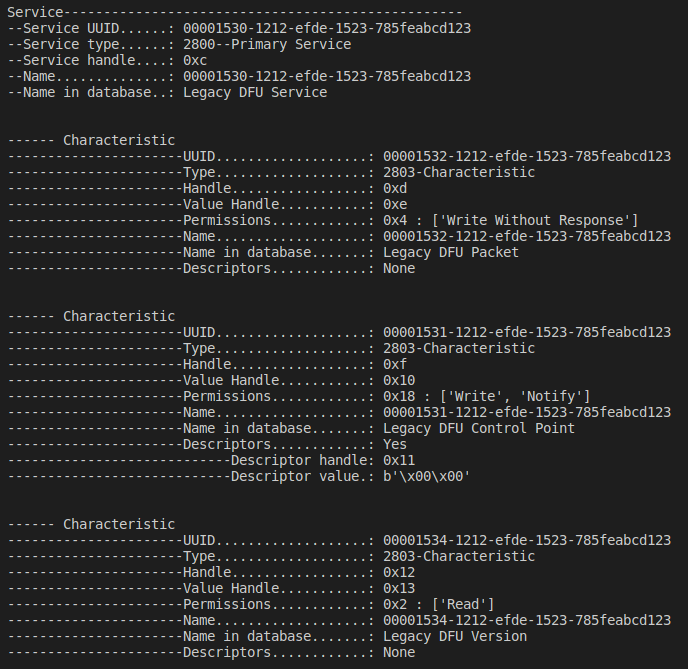
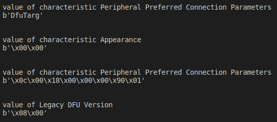
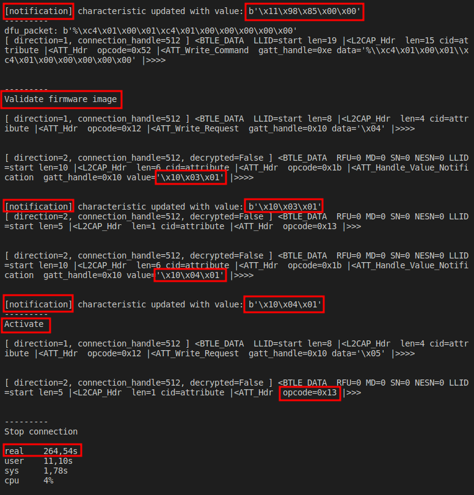

# Reverse nrf52 on sdk11.0.0
This version uses open bootloader. Hence, we have to use the old nrfutil to create firmware zip file.

The python program using for the DFU on nrf52 is the same as for nrf51.
This python file has some modifications (for better displaying).

We can also use the firmware of application create from sdk 11 (s130 of nrf51) to update on nrf52. 

