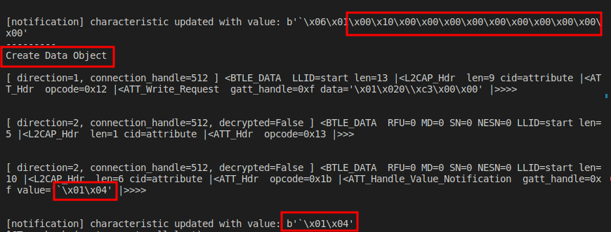
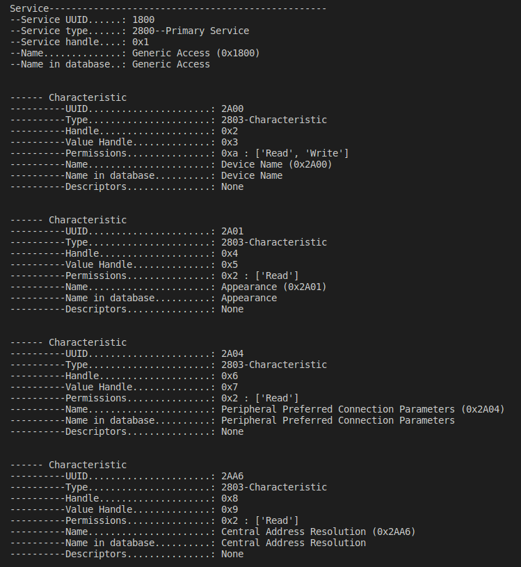
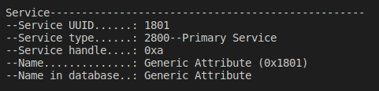
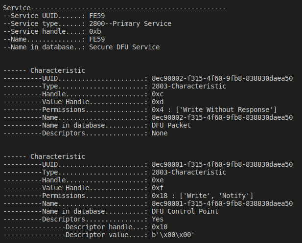
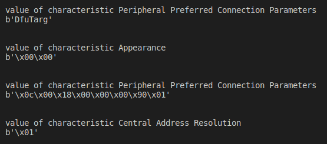
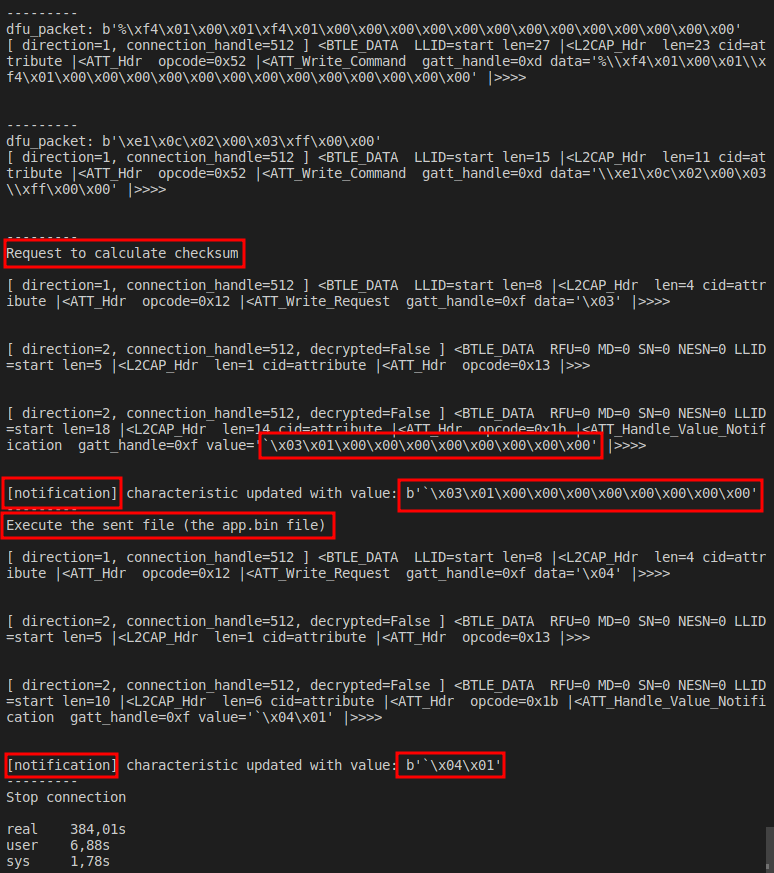

# Reverse nrf52 sdk 12.3.0

It has a characteristic: Central Address Resolution.

The python file: run without argument to use the default firmware zip file in _build folder
otherwise input a path to a firmware zip file.

**Attention**: When send the firmware size, even the response is 04, the file still continue to send.

To create firmware compatible with this version, need option "--no-backup"

